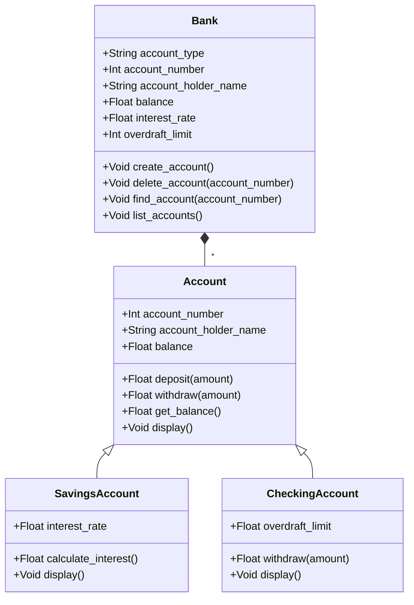

# UML Class Diagram

### The following diagram demonstrates the relationship between `Bank`, `Account`, `SavingsAccount`, and `CheckingAccount` .

```mermaid
classDiagram
   
    class Account {
        +Int account_number
        +String account_holder_name
        +Float balance
        +Float deposit(amount)
        +Float withdraw(amount)
        +Float get_balance()
        +Void display()
    }
     class Bank {
         +String account_type
         +Int account_number 
         +String account_holder_name 
         +Float balance
         +Float interest_rate 
         +Int overdraft_limit
         +Void create_account()
         +Void delete_account(account_number)
         +Void find_account(account_number)
         +Void list_accounts() 
     }   
     
    class SavingsAccount  {
        +Float interest_rate
        +Float calculate_interest()
        +Void display()
    }
    class CheckingAccount {
        +Float overdraft_limit
        +Float withdraw(amount)
        +Void display()
    }
    
    Account <|-- SavingsAccount
    Account <|-- CheckingAccount
    Bank *-- "*" Account   
```
