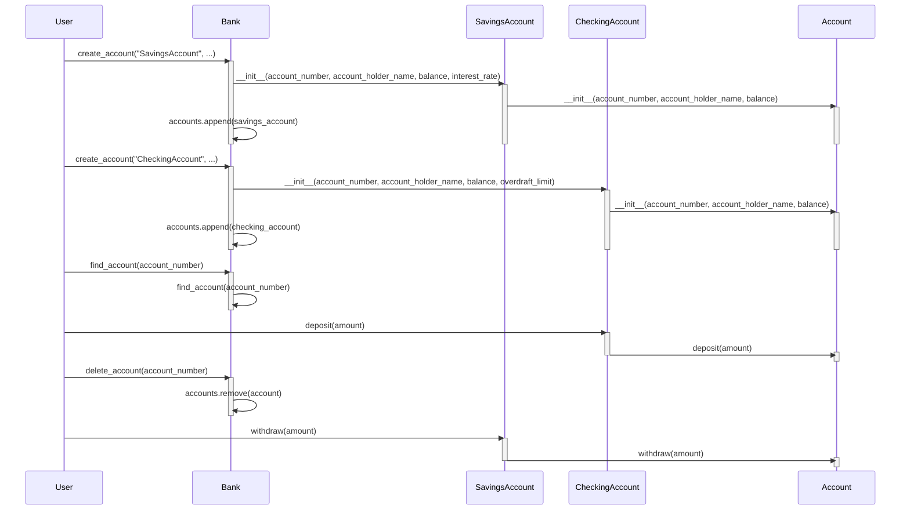

# UML Sequence Diagram
# UML Sequence Diagram
### The following sequence diagram demonstrates the interactions between a user and the bank system

```mermaid
sequenceDiagram
    participant User as User
    participant Bank as Bank
    participant SavingsAccount as SavingsAccount
    participant CheckingAccount as CheckingAccount
    participant Account as Account

    User->>Bank: create_account("SavingsAccount", ...)
    activate Bank
    Bank->>SavingsAccount: __init__(account_number, account_holder_name, balance, interest_rate)
    activate SavingsAccount
    SavingsAccount->>Account: __init__(account_number, account_holder_name, balance)
    activate Account
    Bank->>Bank: accounts.append(savings_account)
    deactivate Account
    deactivate SavingsAccount
    deactivate Bank

    User->>Bank: create_account("CheckingAccount", ...)
    activate Bank
    Bank->>CheckingAccount: __init__(account_number, account_holder_name, balance, overdraft_limit)
    activate CheckingAccount
    CheckingAccount->>Account: __init__(account_number, account_holder_name, balance)
    activate Account
    Bank->>Bank: accounts.append(checking_account)
    deactivate Account
    deactivate CheckingAccount
    deactivate Bank

    User->>Bank: find_account(account_number)
    activate Bank
    Bank->>Bank: find_account(account_number)
    deactivate Bank

    User->>CheckingAccount: deposit(amount)
    activate CheckingAccount
    CheckingAccount->>Account: deposit(amount)
    activate Account
    deactivate Account
    deactivate CheckingAccount

    User->>Bank: delete_account(account_number)
    activate Bank
    Bank->>Bank: accounts.remove(account)
    deactivate Bank

    User->>SavingsAccount: withdraw(amount)
    activate SavingsAccount
    SavingsAccount->>Account: withdraw(amount)
    activate Account
    deactivate Account
    deactivate SavingsAccount


```
