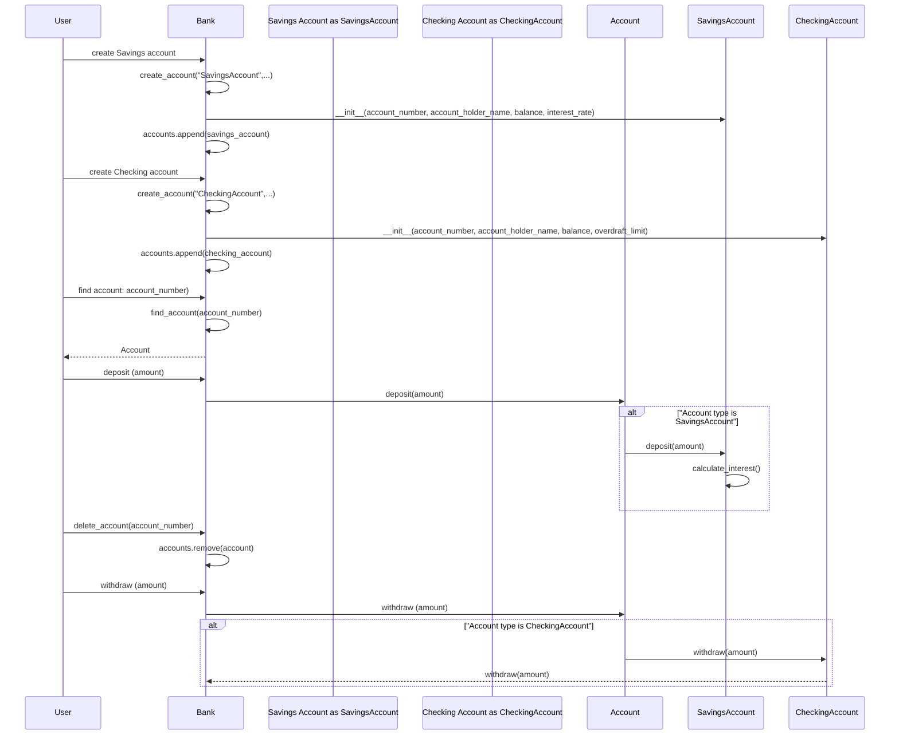

# UML Sequence Diagram
### The following sequence diagram demonstrates the interactions between a user and the bank system
* Creating a Savings account
* Creating a Checking account
* Depositing to a Checking account
* Withdrawing from a Savings account

